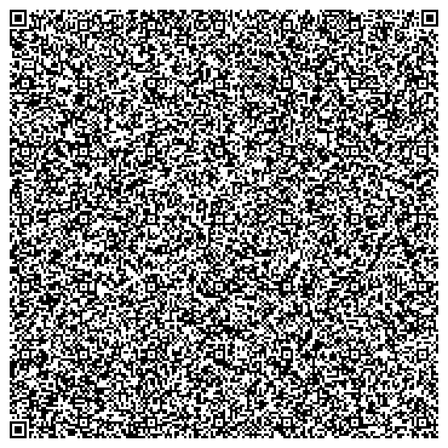

# Minecraft4k
The final, smallest Minecraft. <a href="https://liberapay.com/TheSunCat/donate"> </a>

This repository holds a version of Minecraft which fits inside a QR code.

Read the blog post [here](https://blog.allpurposem.at/can-you-fit-minecraft-in-a-qr-code)!


<br>

## Controls:

- Move: WASD<br>
- Jump: Space<br>
- Break block: Left Click<br>
- Place block: Right Click<br>
<br>
<br>
This project is a reverse-engineered remake of Notch's submission for the Java 4k Contest, where one would submit Java programs of 4096 bytes or less in size.<br>
<br>
Notch submitted Minecraft4k, a heavily optimized and limited Minecraft port. However, the game contained a multitude of bugs and is difficult to play today.
The original build can be found at https://archive.org/details/Minecraft4K. <br>

# Building
You will need SDL2, a standard C build environment (`gcc`, `make`, `strip`), `mono`, `nasm`, the elfkickers package (for `sstrip`), and `lzma`.

You can install all dependencies with the following command on Arch systems:
```
sudo pacman -S elfkickers xz mono nasm gcc make binutils sdl2
```

Just type `make`, and the game should build in a few seconds.<br>
You can run it with `./Minecraft4k`. If nothing happens, you may want to try running Minecraft4k.elf, which has less evil hacks applied.

Note that this is only confirmed to work on AMD Wayland platforms. There's a lot of nonstandard stuff happening here, so I'd be surprised if it works elsewhere!
